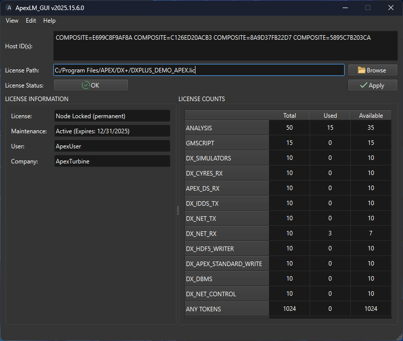

# Apex License Manager (ALM)

### Next generation licensing for APEX Turbine software applications

<figure><figcaption></figcaption></figure>

<table data-view="cards"><thead><tr><th></th><th></th><th></th><th data-hidden data-card-target data-type="content-ref"></th><th data-hidden data-card-cover data-type="files"></th></tr></thead><tbody><tr><td>Introduction</td><td></td><td></td><td><a href="apex-license-manager-alm/introduction.md">introduction.md</a></td><td><a href=".gitbook/assets/LicenseManager.svg">LicenseManager.svg</a></td></tr><tr><td></td><td>Installation</td><td></td><td><a href="getting-started/installation.md">installation.md</a></td><td><a href=".gitbook/assets/ALMtasktraymenu.png">ALMtasktraymenu.png</a></td></tr><tr><td></td><td></td><td>Getting Started</td><td><a href="getting-started/">getting-started</a></td><td><a href=".gitbook/assets/ALMwindow2.png">ALMwindow2.png</a></td></tr></tbody></table>
