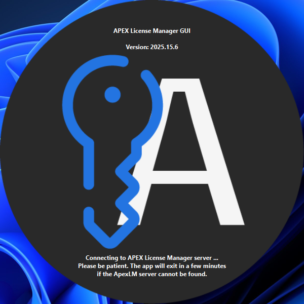
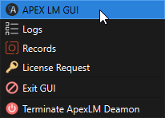

# ALM GUI

To open the GUI, launch the program from the Start menu, File Explorer, or command line terminal. The splash displays while connecting to the APEX License Manager server:

<figure><figcaption></figcaption></figure>

When the splash disappears, right click the ALM icon in the system tray and select the APEX LM GUI option. The main GUI window for the ALM will open.

<figure><figcaption></figcaption></figure>

<figure><figcaption></figcaption></figure>
