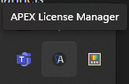
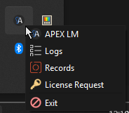

# ALM GUI

<figure><figcaption></figcaption></figure>

 

<figure><figcaption></figcaption></figure>

The ALM launches silently. This means that no GUI pops up on launch. To open the GUI, right click the ALM icon in the system tray and select the APEX LM option. The main GUI windows for the ALM will open.
