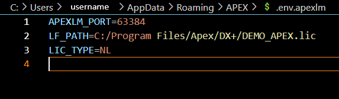

# Environment Variable File

<figure><figcaption></figcaption></figure>

The environment variable file stores information as key=value pairs. This file is modified when the ALM changes licenses modes, the license path, or the port. The environment variable file is located at `C:\Users\<user>\AppData\Roaming\APEX\.env.apexlm` The environment variable file can be modified manually in a text editor such as notepad, but it is strongly advised to only modify this file while the ALM is not running. Changing values, such as the port, may hinder APEX applications from communicating with the ALM. The environment variables are updated when a field is changed in the options window or when a license is applied. The following environment variables are listed as follows:

1. **APEXLM\_PORT**: Contains the port that the ALM and all APEX applications will communicate through. If this variable does not exist, the ALM will ask the operating system to generate a free port and store it here. All apex applications that communicate with the ALM will read the value of APEXLM\_PORT to determine what port to connect to. This value is only read by the ALM on startup. Therefore, it is important not to change this value while the ALM is running.
2. **LIC\_TYPE**: Contains the license mode of the ALM on next start up. The values can be LF for node locked license file, LS for license server, and OC for OpenCode.
3. **LF\_PATH**: Contains the path to the most recently used node locked license file. LF\_PATH is only used when LIC\_TYPE is set to NL
4. **SRV\_PATH**: Contains the hostname(s) and port(s) of the most recently used license server or TRIAD
