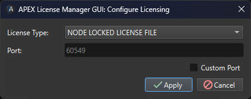

# Node Locked License File

<figure><figcaption></figcaption></figure>

**Node Locked License File**: Requires a Flexera based node locked license file (.lic). To install the license file, Click the browse button and navigate to the license file location. The license path field will update with the license file path. Finally, click the apply button. The fields in the APEX ANALYSIS and APEX ACQUISTION groups will populate with information about the license expiration, maintenance user, company, and license features/counts.
